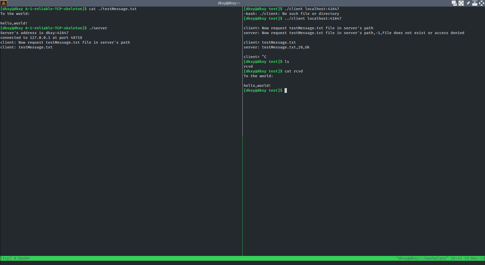

# Reliable TCP 

## Introduction

This is a TCP protocol implementation simulation based on the existing TCP
protocol in your PC.

## Usage

1. execute `./server`
2. execute `./client` in another terminal client with the parameter of IP and
   port
3. input the name of file you want to recive (i.e. testMessage.txt) in client
4. check the recive file `rcvd`.

About the more parameters you could use `-h` to check them.
